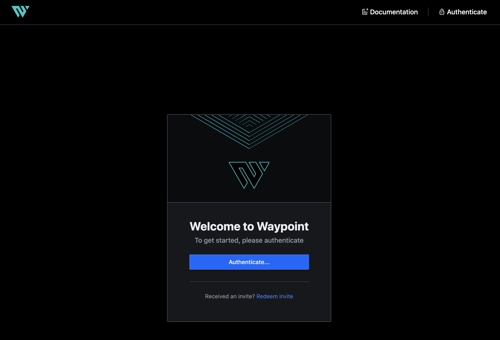
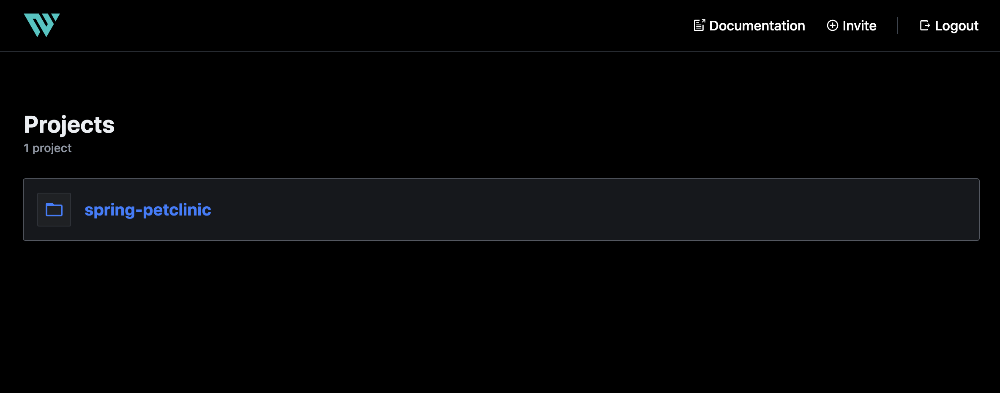
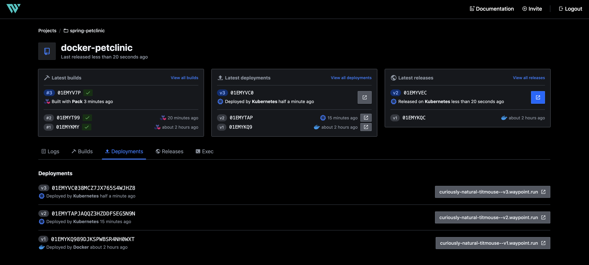
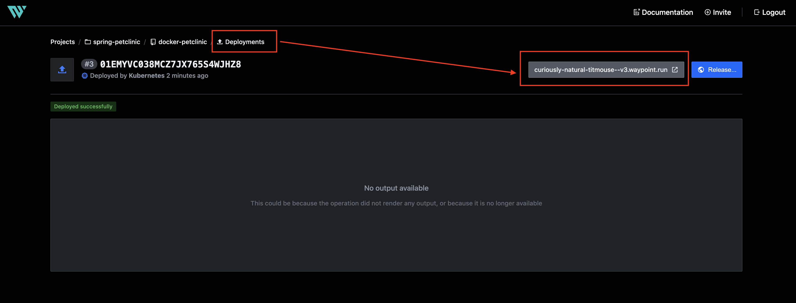
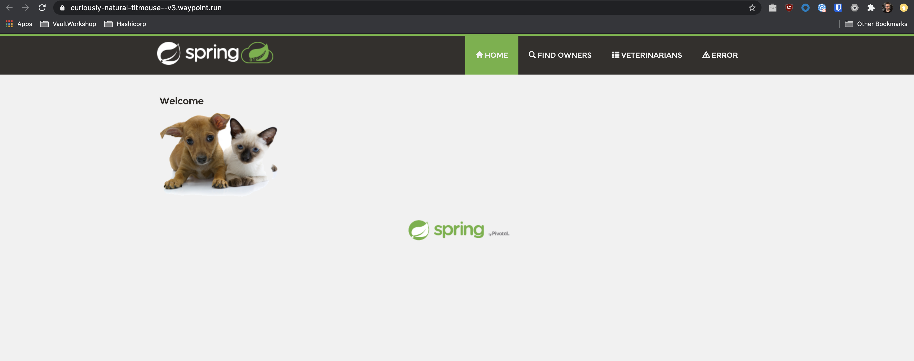

# Deploying Spring Petclinic to Kubernetes with Waypoint

[HashiCorp Waypoint](https://waypointproject.io) is an exciting new solution to deploy your apps from Development to Production with a very easy opinionated lifecycle, from any platform to any environment.

I have created this repo to show a waypoint release pipeline using a well known Spring demo application like [Spring Petclinic]().


## Requirements

* A Kubernetes cluster. I will show here a local cluster with Minikube, but you can also use some other local Kubernetes solutions like [Rancher K3s]() or [MicroK8s]()
* The waypoint binary. You can download it [from here]()
* Docker installed in your machine
* Some shell experience would be helpful, but not needed

That's all!

> NOTE: All this requirements are based on my tests done in MacOS (10.15.7)


## Install Waypoint in Minikube

If you didn't clone this repo, do it now:
```bash
git clone https://github.com/dcanadillas/waypoint-spring-petclinic
```

This step is not really needed, but assuming that you already have the Waypoint binary, pull the docker image to have it locally:
```bash
docker pull hashicorp/waypoint
```

Start your local Kubernetes cluster. I am using Minikube with a dedicated cluster profile named `waypoint`:
```bash
minikube start -p waypoint
```

Once the cluster is started, check that you are in the right context:
```
minikube update-context -p waypoint
```

We are using a Kubernetes namespace to deploy Waypoint server, so let's create it:
```bash
kubectl create ns waypoint
```

**This is a very important step**. Waypoint server is using a Kubernetes service type `LoadBalancer`, so in Minikube you need to create the `tunnel` to get a Load Balancer ip in your service. So, open another terminal and execute (you probably will need to authenticate with your admin user):
```
minikube tunnel -p waypoint
```

Now Minikube is listening for a service to request a Load Balancer IP. 

Let's then install Waypoint in our created Kubernetes cluster. It is very simple:
```bash
waypoint install -platform=kubernetes -namespace=waypoint -accept-tos
```

It installs a `StatefulSet` application in Kubernetes and deploys a service. You should see an output like this:
```
service/waypoint created
statefulset.apps/waypoint-server created
Waypoint server successfully installed and configured!

The CLI has been configured to connect to the server automatically. This
connection information is saved in the CLI context named "install-1603049067".
Use the "waypoint context" CLI to manage CLI contexts.

The server has been configured to advertise the following address for
entrypoint communications. This must be a reachable address for all your
deployments. If this is incorrect, manually set it using the CLI command
"waypoint server config-set".

Advertise Address: 10.102.61.230:9701
HTTP UI Address: https://10.102.61.230:9702
```

Check that resources are there (command and output):
```
$ kubectl get sts,svc,pvc,po -n waypoint -o name
statefulset.apps/waypoint-server
service/waypoint
persistentvolumeclaim/data-waypoint-server-0
pod/waypoint-server-0
```

If you go in your browser to the `HTTP UI Address` from before, you should see the Waypoint UI login:




To authenticate you need your token, so create it from your terminal:
```
waypoint token new
```

This should output your token to authenticate in the UI.

Your Waypoint server is now deployed! Now you are ready to initialize your project.


## Initialize and deploy Spring Petclinic with Waypoint

In this repo you have a `waypoint.hcl` configuration file for your project. But you may need to change the [`registry` stanza](https://www.waypointproject.io/docs/waypoint-hcl/registry#registry-stanza) to use your docker registry. (Please, bear in mind that this configuration is using a public registry to pull the image in the Deployment stage, but you need to have the authentication configured with the [`credentials helper`](https://docs.docker.com/engine/reference/commandline/login/#credential-helpers) to be able to push.):

```hcl
project = "spring-petclinic"

...

        registry {
          use "docker" {
            image = "<your_public_registry>/spring-petclinic"
            tag   = "latest"
          }
        }
...

```

You should be ready to init your project!
```
waypoint init
```

If you go to your browser and authenticate into Waypoint you should see now your project:



Let's deploy the Spring Petclinic application. It will build the Spring application using a [Cloud Native Buildpack](https://buildpacks.io/) builder, it will push the docker container into your registry, and it will deploy the application into the `waypoint`. Waypoint will make your application available in an environment URL, where you can access.

Let's execute all of that with one simple CLI lifecycle command:
```bash
waypoint up
```

The output should be something similat to:
```
» Building...
Creating new buildpack-based image using builder: heroku/buildpacks:18
 + Creating pack client
 + Building image
 │ [exporter] Reusing layer 'launcher'
 │ [exporter] Reusing layer 'config'
 │ [exporter] Adding label 'io.buildpacks.lifecycle.metadata'
 │ [exporter] Adding label 'io.buildpacks.build.metadata'
 │ [exporter] Adding label 'io.buildpacks.project.metadata'
 │ [exporter] *** Images (88ee3320ba06):
 │ [exporter]       index.docker.io/library/docker-petclinic:latest
 │ [exporter] Reusing cache layer 'heroku/jvm:jdk'
 │ [exporter] Reusing cache layer 'heroku/jvm:utils'
 │ [exporter] Adding cache layer 'heroku/maven:maven'
 + Injecting entrypoint binary to image

Generated new Docker image: docker-petclinic:latest
 + Tagging Docker image: docker-petclinic:latest => gcr.io/hc-dcanadillas/spring-petclinic:latest
 + Pushing Docker image...
 │ b60924f6c87b: Layer already exists
 │ f17e4577644b: Layer already exists
 │ 69ff5f44b0cb: Layer already exists
 │ 8dff7465e43d: Layer already exists
 │ 17cb30386b24: Layer already exists
 │ 7a694df0ad6c: Layer already exists
 │ 3fd9df553184: Layer already exists
 │ 805802706667: Layer already exists
 │ latest: digest: sha256:3459d7cd150176d3050113880367cdb6dc58b67636148d66b1359bde0
 │ 12724ed size: 2831
 + Docker image pushed: gcr.io/hc-dcanadillas/spring-petclinic:latest

» Deploying...
 + Kubernetes client connected to https://192.168.64.10:8443 with namespace waypoint
 + Creating deployment...
 + Deployment successfully rolled out!

» Releasing...
 + Kubernetes client connected to https://192.168.64.10:8443 with namespace waypoint
 + Updating service...
 + Service is ready!

» Pruning old deployments...
  Deployment: 01EMYTAPJAQQZ3HZDDFSEG5N9N

The deploy was successful! A Waypoint deployment URL is shown below. This
can be used internally to check your deployment and is not meant for external
traffic. You can manage this hostname using "waypoint hostname."

   Release URL: http://10.109.49.5:80
Deployment URL: https://curiously-natural-titmouse--v3.waypoint.run
```

After finishing you can also see your deployments in Waypoint UI:



And from there you can select the deployment and open the application deployed:



If you click to your deployment you should be redirected to the application:




